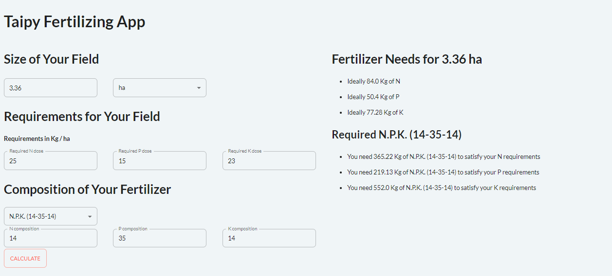

# Fertilizer Calculator

This is a simple application that uses Taipy GUI to create a fertilizer calculator.

## Goal of this Application

This application aims to show the following:

* While you can use Taipy to create big Machine Learning applications, you can also use it to create small converter applications fast.
* This application shows, in a simple example, how to use different types of Callbacks with Taipy, at the selector and at the button level. 

### Important Note About Using this Application

* Fertilization in agriculture is complex. This app is not suitable for planning fertilization because:
    * It doesn't include all necessary nutrients.
    * It doesn't factor in organic materials.
    * It doesn't consider the timing of product application based on different crops.
* You can use this app to understand how to convert element units. A more comprehensive calculator, including various nutrients and fertilizers, could be useful for agricultural technicians or vendors.
* Fertilization is often regulated (at least in the European Union). This application is not for use in regulated situations like production decision-making and counseling. 

## How to Use the Application

* Introduce the size of your field (surface)
* Introduce your field requirements as dose per hectare (depending on crop, production goal and available nutrients)
* Select your fertilizer product. You can change NPK content manually

## Data

The dataset is the [fertilizer_npk](https://www.kaggle.com/datasets/shekharyada/fertilizer-npk) that you can find on Kaggle. I have modified the dataset for usability:

* Ordered alphabetically, removed duplicates, changed name of products to make them all unique.